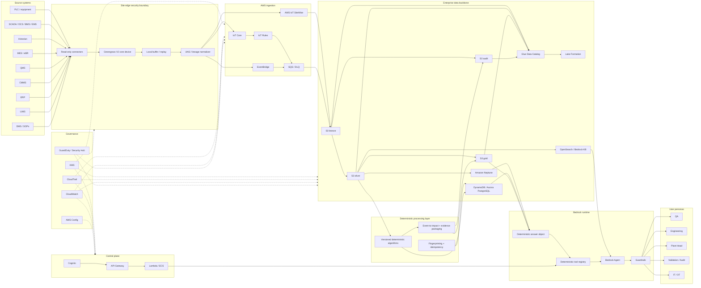

# Master Architecture Diagram

## Summary

This diagram represents the mission-critical Areos target architecture.

- Areos = **Assurance, Reliability, Efficiency Operating System**
- system of assurance, not system of record
- **Do not sell monitoring; sell proof.**
- Existing systems monitor signals; Areos connects signals to validated state, product impact, and audit evidence.
- Utility event → area → batch/product/material → quality risk → evidence → decision.
- AWS Greengrass V2 only at the site edge; local sandbox is developer/test harness only.

## Mermaid diagram

## Interpretation notes

- The source estate stays in place. Areos does not replace MES, QMS, BMS, EMS, SCADA, historians, CMMS, LIMS, ERP, OEE, or enterprise lakehouse platforms.
- Greengrass V2 establishes the site-edge runtime boundary.
- SiteWise provides hot/warm industrial time-series and asset context.
- S3 + Glue + Lake Formation provide governed lakehouse persistence.
- Neptune stores evidence and provenance relationships.
- DynamoDB / Aurora PostgreSQL store workflow and idempotent processing state.
- OpenSearch / Bedrock KB support retrieval only.
- Deterministic algorithms produce regulated conclusions; Bedrock only renders or explains them.
